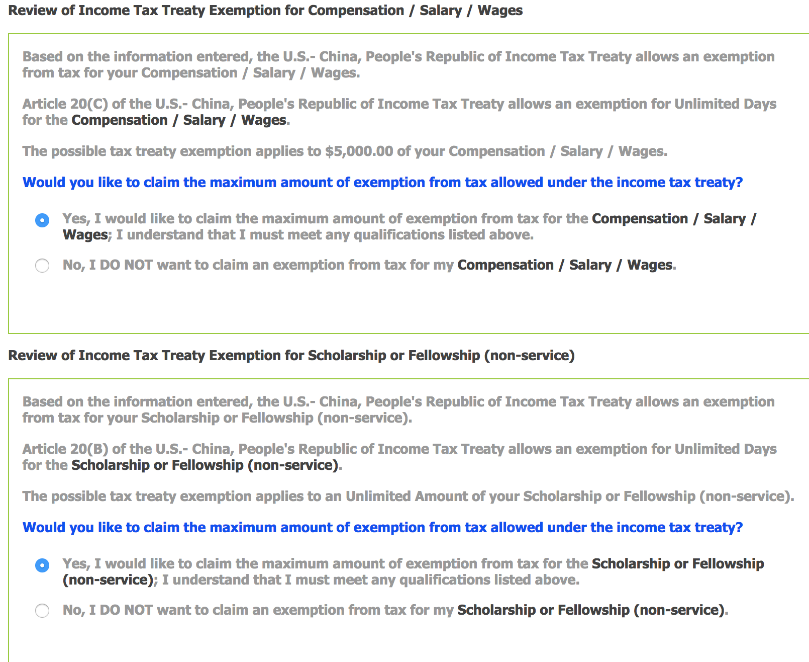
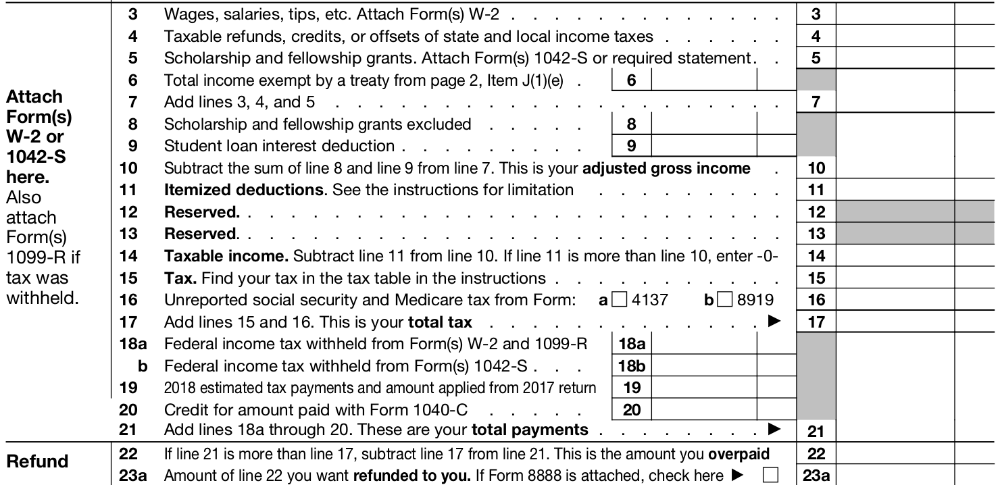
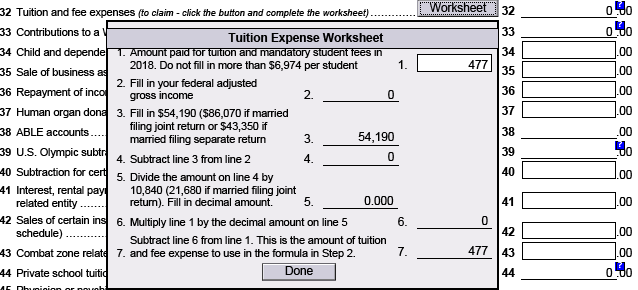

# prepare-tax-return
作为UW-Madison CS 硕士生的个人报税经历。希望对广大F-1留学生报税有参考价值。

## 个人情况
* UW-Madison一年级master, F-1签证
* Non-service scholarship. 此部分根据中美Tax Treaty for Scholarship, 视为nontaxable income
* Research Assistance. 此部分根据中美Tax Treaty for Salary, 前$5000视为nontaxable income
* 该年秋季学期缴纳tuition(包括 segregated fee和International student fee)

## 重要文件
* W-2 Form - 可在[my.wisc.edu](https://my.wisc.edu)下的`Payroll Information`获取。其中包括本年taxable wages的具体数据。
* 1042-S Form - 可在[GLACIER](https://www.online-tax.net/)系统中获取。其中包括本年nontaxable income的具体数据。
* 1098-T Form - UW-Madison Bursar's office会邮寄给你, 你也可以在[网上获取](http://www.bussvc.wisc.edu/bursar/tra97instruct.html)([2018年的1098-T仅可以获取纸质版](http://www.bussvc.wisc.edu/bursar/tra97.html))。其中包括本年度你交纳的学费的具体数据。

## 辅助文件
这部分文件不是报税必须文件，但你可以利用这些文件初步check W-2或者1042-S Form中的数据是否正确:
* 年度最后一张的Earning Statement - 上面可以看到year-to-date的总收入，taxable income和withheld tax的具体数值。会和W-2 Form/1024-S Form相符。
* 每学期在交学费的时候会有Tuition Statement - 上面可以看到你支付的学费与构成。比如有:
  * [Segregated Fee](https://registrar.wisc.edu/tuitionrates/) - $641.04
  * [International Student Fee](https://iss.wisc.edu/international-student-fee-increase/) - $100
  * Registrar Office Document Fee - $65

## 退还联邦税
* 进入[GLACIER](https://www.online-tax.net/)系统中`GLACIER Tax Prep`模块，填写问卷即可。
* 过程中需要输入W-2 Form和1042-S Form的内容。
* 列举问卷中如下值得注意的问题:
  * Country of Tax Residence为中国

  * 
    回答"Yes"表明中美之间的Treaty适用于本人。

  * 
    回答"No"表明被中美Treaty豁免征税的收入不会被中国征税。

  * "Name of Designated School Official" 写 Department Chair。[请参考ISS](https://iss.wisc.edu/employment/taxes/resources-for-filing-taxes/)。
* 问卷中的内容最终会产生一个tax document, 包括如下Form:
  * 1040NR-EZ (an easy version of 1040 Form for Non-redisent): 为单身低收入NRA(Non-redisent Alien)(e.g. UW-Madison学生)报税时所填的表格。
  * 8843表格: 美国政府收集NRA信息的与退税无关的表格。NRA不论是否有收入都应填写。
* 按照tax document上面的要求进行打印，签字和寄送。
* 可以网上跟踪tax refund状态(暂未尝试)

## 了解Form 1040NR-EZ
这部分内容跟具体报税操作无关，但我们不妨对联邦税的机制有一个初步的认识：

我们记xi为标号为i的行所记录的数值。
* 在我们准备tax return之前，联邦已经从我们的个人收入中拿走了一部分(x21)作为我们上缴的税收。x21通常情况下为x18a(从taxable wage处拿走的税收) + x18b(从nontaxable income处拿走的税收)。
* 但实际上根据中美的treaty，我们的scholarship和前$5000的income因为豁免的关系变成了nontaxable的。也就是我们这里的x6。我们要缴纳的税款仅来源于taxable wage也就是x3。
* 一个更好的消息是,我们仍可以从taxable wage中扣除一部分钱(x11), 而最终剩下的余额(x14)才是我们的税款来源。因此我们实际缴纳的税款是x15。而x22 = x21 - x15，就是联邦政府多收我们的税款，也就是我们本次申请退还的联邦税数额。对于NRA，x11一般为个人收入中预留作为州税的部分，这部分不用再视为联邦税的收入来源。
* 带入你自己报表中的数据算一算，如果你的个人收入情况比较简单，数据是能够对上的。

## 报州税
与联邦税需要自行寄送税表不同，州税可以网上提交税表:
* 进入[Wisconsin e-file](https://www.revenue.wi.gov/Pages/WI-efile/home.aspx), 下载`Individuals-choose a form:`中的Form 1NPR，用Adobe Reader 9打开进行填写和提交。
* Form 1NPR名目繁多，感兴趣的可以对照[表格说明手册](https://www.google.com/url?q=https://www.revenue.wi.gov/TaxForms2017through2019/2018-1NPR-inst.pdf)细致了解。这里提及几处重要项目的填写:
  * 

    “99”表示非美国居民，不属于任何州。
  * 

    因为Wisconsin State同样承认中美之间的treaty，所以通常情况下A, B两栏的数额相同。均为W-2 Form中的taxable wages.
  * 

    Wisconsin州允许NRA利用个人缴纳的学费抵消部分纳入税收范围的收入(联邦税不允许NRA这样做)，从而减少实际需要缴纳的州税税额。为了使用这项福利，我们要在表格开始处启动Schedule M，并且在上图所示处点go按钮。

  * 
   之后点击Worksheet按钮，并在第一个空格处填入你本年度缴纳的学费，正常情况下与1098-T表格中显示的数额一致。

  * 
    Wisconsin州还可以进一步根据你是否单身，是否成年等情况进一步减小纳入税收范围的收入。F-1留学生通常此处填写1。具体请查阅说明手册。

## 了解Form 1NPR
  * 
    
    沿用之前的标识方法。x63是在逐步缩小纳入税收范围的收入之后，我们实际需要缴纳的税款。x64是在我们准备tax return之前，州税务局从我们的收入中拿走的税款。x76 = x64 - x63 就是州政府多收我们的税款，也就是我们本次申请退还的州税数额。

## Q&A
* 非美国居民的银行开卡Bonus和利息不用交税。
* 1098-T Form中的学费数额跟Student Center里显示的交易数额不一致。怎么回事？

  To be answered!

* 1042-S Form里的nontaxable wage没有到5000，但W-2 Form中的taxable wage不为0。怎么回事？

  To be answered!

## Helpful Links
* https://www.revenue.wi.gov/Pages/FAQS/pcs-vita.aspx

## Hint

* 移步至[报税指南](报税指南.pdf)了解与税收相关的基本概念和表格介绍(鸣谢[UW-Madison中国学生学者联合会](https://uwcssa.net/))。

* 第一年报税才知道应该多加留意美国各式各样的表格文件，之前并没有这个意识。
